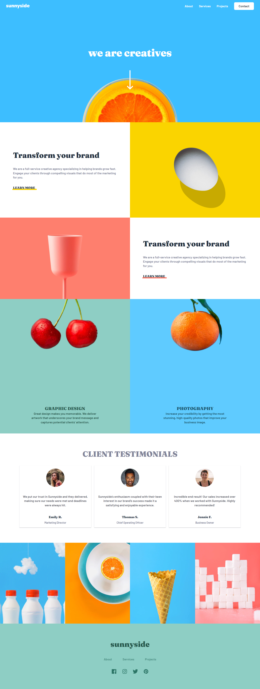
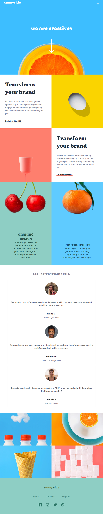
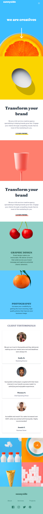

# Frontend Mentor - Calculator app solution

This is a solution to the [Sunnyside agency landing page challenge on Frontend Mentor](https://www.frontendmentor.io/challenges/sunnyside-agency-landing-page-7yVs3B6ef). Frontend Mentor challenges help you improve your coding skills by building realistic projects. 

## Table of contents

- [Overview](#overview)
  - [The challenge](#the-challenge)
  - [Screenshot](#screenshot)
  - [Links](#links)
- [My process](#my-process)
  - [Built with](#built-with)
  - [What I learned](#what-i-learned)
  - [Continued development](#continued-development)
  - [Useful resources](#useful-resources)
- [Author](#author)
- [Acknowledgments](#acknowledgments)

**Note: Delete this note and update the table of contents based on what sections you keep.**

## Overview

### The challenge

Users should be able to:

- See the size of the elements adjust based on their device's screen size
- Perform mathmatical operations like addition, subtraction, multiplication, and division
- Adjust the color theme based on their preference
- **Bonus**: Have their initial theme preference checked using `prefers-color-scheme` and have any additional changes saved in the browser

### Screenshot





### Links

- Solution URL: [Add solution URL here](https://github.com/jettechnologies/sunnyside-website)
- Live Site URL: [Add live site URL here](https://sunnyside-marketing-website.netlify.app/)

## My process

### Built with

- Semantic HTML5 markup
- CSS Grid and Flexbox
- Mobile-first workflow
- [Tailwind css and its layers customization](https://tailwindcss.com/)
- [React](https://reactjs.org/) - JS library
- [Framer motion](https://www.framer.com/motion/)

### What I learned
I learnt how to create layers or custom component using tailwind css @apply feature which allows one to create custom utility classes that can encapsulated all the little utility classes need for that component and also i learnt how to set css variables using tailwindcss @layer and css root value:

```css
#link-two::before{
  @apply bg-about-second-section rounded-sm;
}
```  

```css 
  @layer{
  :root{
    --header-height: 4rem;
    --hero-height: calc(100dvh - var(--header-height));
    --section-height: calc(100dvh + var(--header-height));
  }
}
```  
and i also learnt how to implement various animation such as inView animations and also spinning animation with ease using framer motion animation library

### Continued development

I would like to create more complex animation for the agency website using framer motion

## Author

- Frontend Mentor - [@jettechnologies](https://www.frontendmentor.io/profile/jettechnologies)

